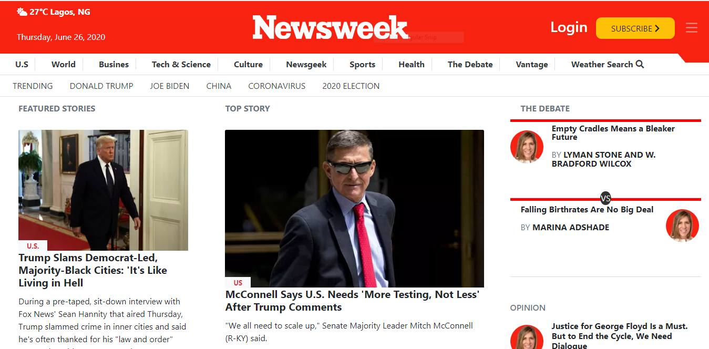

## The Next Web
This is The Newsweek Web clone.

PROJECT: BUILDING WITH RESPONSIVE DESIGN (BOOTSTRAP)
<br>
In this project, my main aim was to learn how to build a responsive website with Bootstrap and media queries.The website is responsive on different screen sizes, such as mobile, tablet and desktop.

Project Design Screenshot : 


## Built With

- HTML5
- CSS3
- Bootstrap

## Live Demo

[Live Demo Link](https://rawcdn.githack.com/Godswilly/the-next-web/55b5d960c7f3615cc71287f35ffb884513d2aec9/index.html)

## Getting started
**I cloned The Newsweek. The main aim was to make the website responsive in devices of different screen sizes.The elements get placed and styled roughly the same way as the source, so functionality is not a priority.**

I used the browser’s developer tools to inspect the real The Newsweek page to understand how elements are placed and styled using Bootstrap.
I built my own page in a .html text file and opened it in our browser to check it out. I carried out the following steps:
  - First setup a github repository for the project.
  - Then create a .html file where all our HTML markup will go.
  - Create a .css file where all our styling code will reside.


## How To Use 🔧

From your command line, first clone the project:

```bash
# Clone this repository
$ git clone https://github.com/Godswilly/news-week/tree/feature

# Go into the repository
$ cd feature


```

## AUTHOR
👤 **Kalu Agu Kalu***

- [Github]( https://github.com/Godswilly)
- [Twitter](https://twitter.com/KaluAguKalu17)
- [Linkedin](https://www.linkedin.com/in/kalu-agu-kalu/)


## Show your support

Give a ⭐️ if you like this project!

## Acknowledgments

- Thanks to Microverse and The Odin Project.

## 📝 License

This project is [MIT](lic.url) licensed.
